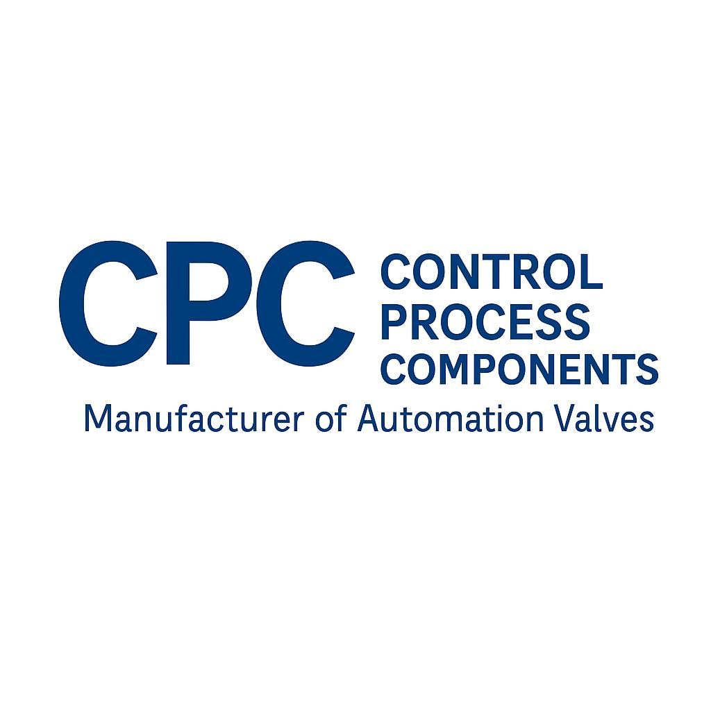

  
  <h1>CPC Valve Industry Web</h1>
    <h1>http://controlprocesscomponents.ae</h1>

  
Category driven product experience with Custom HTML, Custom PHP, and WordPress CMS

  

    <a href="#overview">Overview</a> •
    <a href="#why-this-architecture">Why this architecture</a> •
    <a href="#how-it-works">How it works</a> •
    <a href="#project-structure">Project structure</a> •
    <a href="#setup">Setup</a> •
    <a href="#deployment">Deployment</a>
  

  

    
    
    
  

 

## Overview
CPC Valve Industry Web is a category driven website built to deliver a cleaner browsing experience than classic product-first navigation.

Instead of managing every page as a WooCommerce product, we use:

• WordPress categories as the main content backbone  
• A custom "category type" layer to shape different page templates  
• Custom PHP and custom HTML blocks for full control of UI and performance

This makes managing pages easier, keeps the navigation consistent, and improves the user journey.

## Why this architecture
Typical product-based setups become messy when you need:

• Many informational pages that are not real products  
• Multiple templates for different industrial categories  
• A fast and consistent UX across browsing, filters, and catalogue downloads

Our approach solves that by treating categories as first-class pages, then attaching a page behavior using category type.

## How it works
High level flow:

• Admin creates or updates Categories  
• Each category gets a Category Type (template behavior)  
• Frontend renders a category page with a custom HTML layout  
• Optional catalogue download is generated per category or per item

Common patterns used:

• Category landing page with featured cards  
• Subcategory grid and navigation  
• Template variations by category type  
• Catalogue download button mapped to a consistent URL pattern

  <h2>📬 Contact Me</h2>
  
Interested in working together? Let's talk.

  <table style="border: none; border-collapse: collapse;">
    <tr>
      <td style="padding: 10px;">
        
      </td>
      <td style="padding: 10px; text-align: left;">
        <strong>Email:</strong> <a href="mailto:mohammadreza.dalili@live.com" style="text-decoration: none; color: #333;">mohammadreza.dalili@live.com</a>
      </td>
    </tr>
    <tr>
      <td style="padding: 10px;">
        
      </td>
      <td style="padding: 10px; text-align: left;">
        <strong>LinkedIn:</strong> <a href="https://www.linkedin.com/in/mohamadreza-dalili/" target="_blank" style="text-decoration: none; color: #0077b5;">/in/mohamadreza-dalili</a>
      </td>
    </tr>
    <tr>
      <td style="padding: 10px;">
        
      </td>
      <td style="padding: 10px; text-align: left;">
        <strong>Portfolio:</strong> <a href="https://mrdalili.com" target="_blank" style="text-decoration: none; color: #333;">mrdalili.com</a>
      </td>
    </tr>
  </table>

